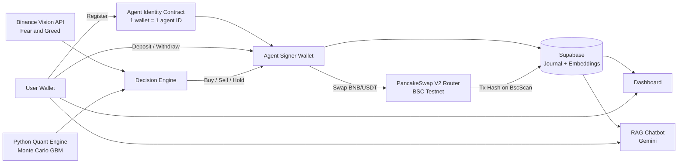
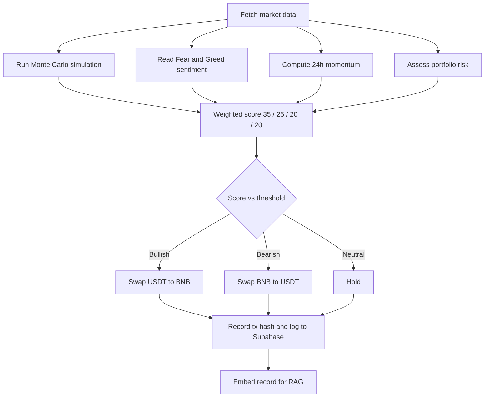
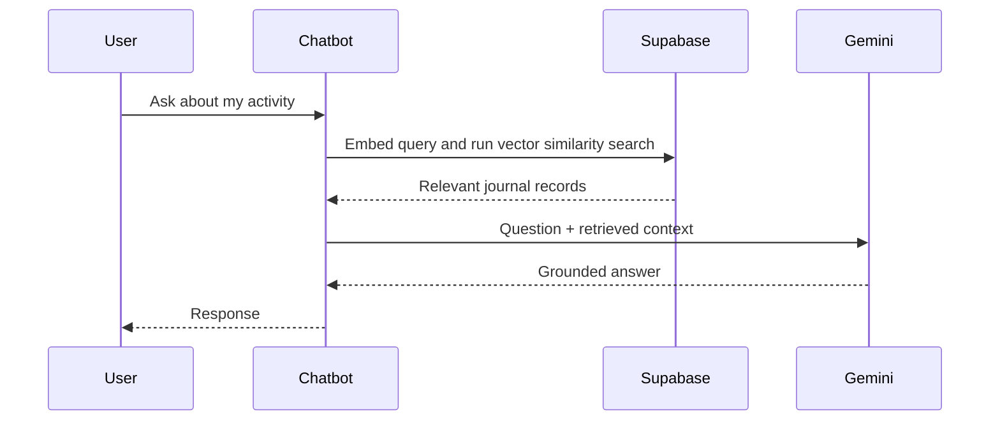

# Nexa: Quant Intelligence for DeFi

> A Web3 AI trading agent for BNB/USDT with on-chain agent identity, verifiable trades, and a RAG chatbot. Live on BSC Testnet.

[Demo Video](https://youtu.be/F037XlsFcqI) · [Live App](https://frontend-weld-psi-75sbyfvmt9.vercel.app/) · [Agent Identity Contract on BscScan](https://testnet.bscscan.com/address/0xD28C0817e9FD45cA99E1Ff154925c87a335e2F5a)

**Agent Identity Contract (BSC Testnet):** `0xD28C0817e9FD45cA99E1Ff154925c87a335e2F5a`

---

## Problem

Trading BNB/USDT manually is time-consuming, emotional, and impossible to sustain around the clock. Retail traders often decide based on hype or fear, ignore portfolio risk, and have no structured way to weigh statistical probabilities against market sentiment.

Most trading bots are also black boxes: users can't see why a trade happened, can't verify it on-chain, can't tell which agent is acting on their behalf, and can't easily query their own deposit, withdrawal, and trade history.

## Solution

Nexa is a Web3 AI trading agent focused on BNB/USDT. It executes real swaps on PancakeSwap through an autonomous signer wallet, with no repeated wallet pop-ups.

- **Multi-factor decisions:** each trade comes from a weighted score of Monte Carlo simulation (3,000 Geometric Brownian Motion paths), market sentiment, 24-hour momentum, and portfolio risk.
- **On-chain agent identity:** every wallet gets its own agent ID through a smart contract (1 wallet = 1 agent), so each user's agent is verifiable and traceable.
- **Full transparency:** every deposit, withdrawal, and trade is recorded with its BscScan transaction hash.
- **Conversational access:** records are stored in Supabase with vector embeddings that power a Gemini-based RAG chatbot, so users can ask about their own activity in natural language.

Nexa currently runs on BSC Testnet, with mainnet as the next step.

---

## Core Features

### 1. Autonomous AI Trading Agent (BNB/USDT)
- Executes **real swaps on PancakeSwap V2 Router** (tBNB and tUSDT on testnet), not simulated trades.
- Uses a server-side **autonomous signer wallet**, so trades execute instantly without a wallet pop-up for every action.
- Users deposit capital to the agent and can withdraw at any time from the dashboard.
- Manual swap buttons (tUSDT to tBNB, tBNB to tUSDT) and an **AI Auto Swap** mode where the agent decides the direction itself.
- Every trade produces a BscScan transaction hash, so all activity is publicly verifiable.

### 2. On-Chain Agent Identity ("Agent ID Card")
- Every wallet is linked to its own agent identity through a smart contract: **1 wallet = 1 agent ID**.
- The agent logic is the same for everyone, but each wallet has its own on-chain identity, so it is clear which agent acts for which user.
- This gives every user's agent a verifiable, traceable footprint on BNB Smart Chain.

### 3. Multi-Factor Decision Engine
The agent combines four weighted factors into one decision score instead of relying on a single indicator:

| Factor | Weight | What it measures |
|---|---|---|
| Monte Carlo probability | 35% | Outcome probability from 3,000 simulated future price paths |
| Market sentiment | 25% | Fear & Greed Index plus overall market sentiment |
| 24h momentum | 20% | Price change and volume over the last 24 hours |
| Portfolio risk | 20% | Diversification and capital-to-wallet ratio |

The weights sum to 100% and live in a single config object, so the strategy can be tuned without rewriting the agent.

### 4. Quant Lab (Monte Carlo Engine)
A Python 3.12 engine simulates price paths with **Geometric Brownian Motion** (`dS = μS dt + σS dW`), using historical volatility from Binance and CoinGecko data. BNB/USDT is the core pair that feeds the agent; the lab also lets users explore other pairs for analysis only.
- Horizons: 7, 14, 30, 60, and 90 days
- Outputs: expected projected price, bullish probability, annualized volatility, probability of a >10% rise or fall, and a P5 to P95 percentile valuation table

*Example run (BNB/USDT, 30 days): 83.3% probability of finishing above entry price, 28.4% annualized volatility, and a P5 to P95 range of about $721 to $983.*

### 5. Financial Journal and Dashboard
- Overview: active trading equity, realized PnL, total deposited, total withdrawn, live BNB/USDT price, market sentiment, and the latest trades
- Trading Journal with search and filters (All, Trading PnL, Deposit, Withdrawal)
- Data is synced to **Supabase** and cross-checked against on-chain proof

### 6. Nexa AI Assistant (RAG Chatbot)
- Every journal entry and trade is stored in Supabase with **vector embeddings**
- The chatbot retrieves relevant records through semantic search and answers from the user's real data
- Powered by **Google Gemini** with a **Thinking Mode** (visible reasoning) and selectable fast models
- Can also run Monte Carlo analysis, check market data, and give BUY/SELL/HOLD signals on request
- Example questions: *"How much did I withdraw this week?"*, *"What was my latest trade result?"*, *"Analyze BNB price for the next 30 days."*

### 7. Reliable Data and Wallet Onboarding
- Live prices, 24h volatility, and Fear & Greed data through multi-region **Binance Vision API** endpoints with automatic fallback
- Supports MetaMask, Rabby, Trust Wallet, Rainbow, and WalletConnect, with automatic switching to BSC Testnet and balance sync
- Bilingual interface (English and Indonesian)

---

## Architecture



## Decision Flow



## RAG Pipeline



---

## Tech Stack

- **Chain:** BNB Smart Chain (BSC Testnet, mainnet planned)
- **Smart contract:** Agent identity contract (1 wallet = 1 agent ID)
- **DEX:** PancakeSwap V2 Router
- **Quant engine:** Python 3.12 (Geometric Brownian Motion, 3,000 paths)
- **AI:** Google Gemini (reasoning and RAG chatbot)
- **Data layer:** Supabase (Postgres + vector embeddings)
- **Market data:** Binance Vision API, CoinGecko, Fear & Greed Index
- **Wallets:** MetaMask, Rabby, Trust Wallet, Rainbow, WalletConnect

## Current Status

- Live on BSC Testnet with real on-chain swaps on BNB/USDT
- Agent, agent identity contract, dashboard, Quant Lab, and RAG chatbot are functional
- Next: extended testnet runs, strategy tuning, then mainnet deployment

## Why Nexa

- **Focused:** one pair (BNB/USDT), one clear strategy
- **Multi-factor:** probability, sentiment, momentum, and risk are weighed together
- **Verifiable:** every wallet has an agent ID, and every trade has a BscScan transaction hash
- **Conversational:** users query their own on-chain history in plain language

---

## Getting Started

> Replace the commands and variable names below with your actual setup.

```bash
git clone https://github.com/<your-org>/<your-repo>.git
cd <your-repo>
npm install
cp .env.example .env
npm run dev
```

Environment variables (see `.env.example`):

```env
NEXT_PUBLIC_SUPABASE_URL=
NEXT_PUBLIC_SUPABASE_ANON_KEY=
SUPABASE_SERVICE_ROLE_KEY=
GEMINI_API_KEY=
AGENT_SIGNER_PRIVATE_KEY=
AGENT_IDENTITY_CONTRACT=0xD28C0817e9FD45cA99E1Ff154925c87a335e2F5a
```

> **Never commit real keys.** Keep `.env` in `.gitignore`, and use a testnet-only wallet for the agent signer.

## Team

Nexa Team

## Disclaimer

Nexa is a hackathon project running on testnet. It is not financial advice.
